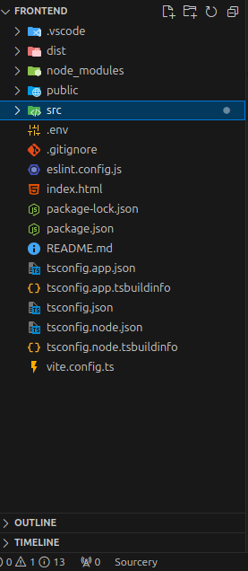
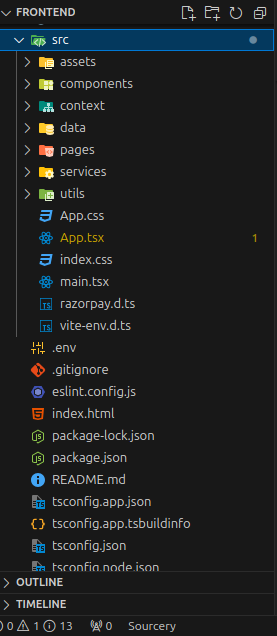
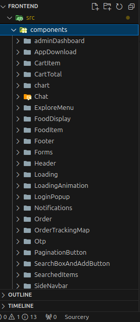
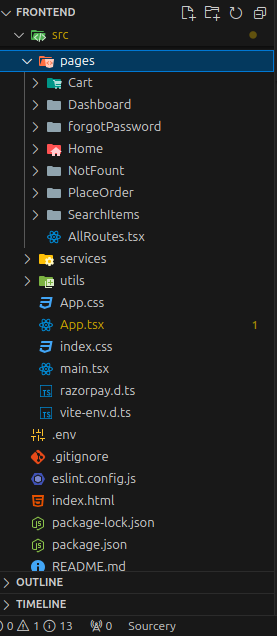
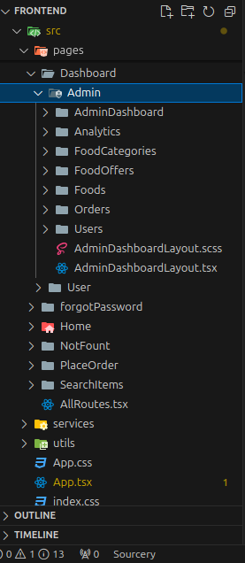
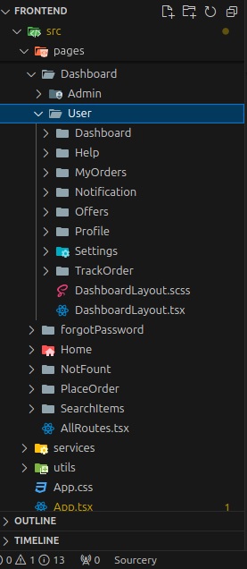

# Apna Restro - Food Delivery System

Apna Restro is a modern food delivery system built using React and Vite, designed to provide users with an intuitive and visually appealing experience. The project includes a well-organized frontend interface, making it easy for customers to browse the menu, place orders, and track deliveries in real-time.

Key features such as real-time order tracking, integrated secure payments, and data visualizations offer a complete, user-centric experience. Live tracking functionality is powered by Leaflet.js, allowing users to view their order’s progress on a map. Recharts is used to provide insights through dynamic graphs and charts, enhancing the admin’s ability to analyze order and sales data. Secure payment handling is implemented through Razorpay, ensuring smooth transactions within the application.

The project structure follows best practices, with a modularized component setup and custom hooks for optimized state management and WebSocket integration. SCSS is used to manage the design, with reusable variables for consistent styling. Vite powers the development process, providing fast builds and efficient bundling for better performance.

The backend of Apna Restro is built using **Django Ninja**, providing a robust and scalable API for handling requests and managing data.

Overall, Apna Restro combines an engaging UI with powerful functionalities to deliver a smooth, interactive food delivery experience. **Future enhancements may include additional features and UI changes as per user requirements.**

## Features

- **Interactive UI**: Easy-to-navigate interface for customers
- **Real-time Order Tracking**: Live location tracking of orders using Leaflet.js
- **Data Visualization**: Use of Recharts for graphical representation of data
- **Payment Integration**: Integrated with Razorpay for secure payments
- **Live Chat Support**: Real-time customer support chat using WebSocket and Django Channels for seamless communication between customers and support staff
- **Get Current Location**: Allows users to fetch their current location for easier address input and delivery accuracy

## User Roles and Login Credentials

To access different dashboards, use the following login credentials:

- **User Dashboard**: 
  - **Email**: `user@gmail.com`
  - **Password**: `User@123`

- **Admin Dashboard**:
  - **Email**: `admin@gmail.com`
  - **Password**: `Admin@123`

- **Staff Dashboard**:
  - **Email**: `staff@gmail.com`
  - **Password**: `Staff@123`

Each dashboard provides role-specific functionalities to enhance the user experience, with admins and staff having access to management features, and users able to view and track their orders.

## Test Payment Details

The payment integration is currently in test mode. Use the following test card details for simulating transactions:

- **Card Number**: `5267 3181 8797 5449`
- **Expiry Date**: Any future date (e.g., 12/30)
- **CVV**: Any 3-digit number (e.g., 123)

## Technologies Used

- **React**: User interface development
- **Vite**: Fast build tool for efficient development
- **TypeScript**: Type safety and enhanced code quality
- **SCSS**: Advanced styling with variables and nesting
- **Recharts**: For data visualization in various charts and graphs
- **Leaflet.js**: Map integration for order tracking and current location features
- **Razorpay**: Secure payment processing
- **WebSocket**: Real-time communication between server and client

## Live Demo

You can check out the live version of the project here: [Live Demo URL](YOUR_LIVE_URL_HERE)

## Installation

### Prerequisites
1. [Node.js](https://nodejs.org/) (v14+ recommended)
2. [npm](https://www.npmjs.com/)

### Steps

1. Clone the repository:
   ```bash
   git clone https://github.com/Rajiv-Ranjan-Kumar/apna-restro.git
   cd apna-restro
   ```

2. Install dependencies:
   ```bash
   npm install
   ```

3. Set up environment variables:
   - Create a `.env` file in the root directory and add your environment variables, such as 
   - `VITE_WEB_SOCKET_URL` 
   - `VITE_WEB_OPENCAGE_API_KEY`
   - `VITE_RAZORPAY_KEY`
   - `VITE_RAZORPAY_SECRET`

4. Start the development server:
   ```bash
   npm run dev
   ```

5. Open your browser and navigate to `http://localhost:5173/` to see the application.


## Folder Structure Screenshots

Here’s an overview of the project structure:

<div style="width: 100%; display: flex; flex-direction: row; flex-wrap: wrap; justify-content: space-between;">
    <div style="width: 48%; margin-bottom: 10px;">
        
    </div>
    <div style="width: 48%; margin-bottom: 10px;">
        
    </div>
    <div style="width: 48%; margin-bottom: 10px;">
        
    </div>
    <div style="width: 48%; margin-bottom: 10px;">
        
    </div>
    <div style="width: 48%; margin-bottom: 10px;">
        
    </div>
    <div style="width: 48%; margin-bottom: 10px;">
        
    </div>
</div>


## Personal Project

This is a personal project developed to enhance my skills and demonstrate my capabilities in building a modern food delivery system. While contributions from others are not expected, I welcome feedback and suggestions for improvement.